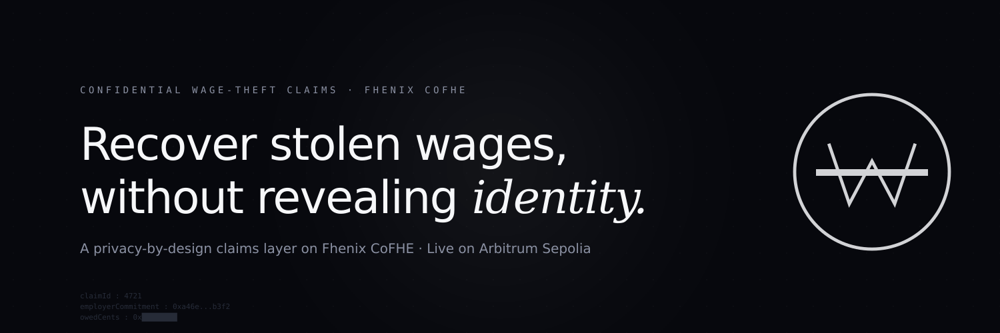

<p align="center">
  
</p>

# WageShield — Confidential Wage-Theft Claims on Fhenix

> **Recover stolen wages without revealing who you are.**

A privacy-by-design dApp on the **Fhenix CoFHE** stack and a first-class plugin to the
**Privara/ReineiraOS** confidential settlement protocol. Workers submit cryptographically
attested wage-theft claims with their **hours, hourly rate, and employer identity all
encrypted**. The contract computes the encrypted owed amount on-chain (`hours × rate`),
folds it into a per-employer aggregate, and lets attorneys + state regulators decrypt only
what they're entitled to see — never more.

**Status:** Wave 4 build, Fhenix Privacy-by-Design Buildathon. Smart contracts compile
cleanly under `solc 0.8.28` + `viaIR`. End-to-end FHE pipeline (encrypt → on-chain
arithmetic → permit-gated decrypt) verified **live on Arbitrum Sepolia + Fhenix CoFHE
testnet** with one signed-and-decrypted real claim — see
[`docs/live-evidence.md`](docs/live-evidence.md). 5/5 mock-environment tests also pass.

## Live deployment — Arbitrum Sepolia (chainId 421614)

| Contract | Address |
|---|---|
| `TimeclockIssuerRegistry` | [`0xB0b85AF6f8ed8cee97D321d4B0FE15428cB0268f`](https://sepolia.arbiscan.io/address/0xB0b85AF6f8ed8cee97D321d4B0FE15428cB0268f) |
| `WageClaim` | [`0x93D7Be555723CCbC964761087C644368049a5AE3`](https://sepolia.arbiscan.io/address/0x93D7Be555723CCbC964761087C644368049a5AE3) |
| `WageTheftResolver` | [`0xc3022f3De7043261DaccdCd1C9Ea8e4BB05ADb53`](https://sepolia.arbiscan.io/address/0xc3022f3De7043261DaccdCd1C9Ea8e4BB05ADb53) |
| `WageTheftPolicy` | [`0x4ce036ea7AF8ED9c187d0d69e52621EdE6d70F42`](https://sepolia.arbiscan.io/address/0x4ce036ea7AF8ED9c187d0d69e52621EdE6d70F42) |

Trusted issuer (mock Homebase): `0x8335bf7fac9786d1877b6E6c613458B4968C8146`.

Any wallet on Arbitrum Sepolia can submit a claim — there's no allow-list of
"workers". The issuer must be on the trusted-issuer registry, but the worker is
whoever signs the transaction.

**Live e2e proof:** [`0xacd2bb10f959326e49a03443381846ded2130bba9ad77c14ee9535d87158b162`](https://sepolia.arbiscan.io/tx/0xacd2bb10f959326e49a03443381846ded2130bba9ad77c14ee9535d87158b162)
— issuer-attested `submitClaim` of 240 hours × $15.00, encrypted on-chain `FHE.mul`,
worker decrypted `$3,600` via CoFHE permit. Block 267,997,665, gas 602,845.

---

## Why this matters

**$50B/year is stolen from US workers** through wage theft (Economic Policy Institute, 2017).
**75% of low-wage workers** experience at least one form of wage theft per year. The number
filing claims is a fraction of one percent — **immigration fear, retaliation risk, and the
need to disclose name + employer + immigration status** at the courthouse door deter the
overwhelming majority.

> When a worker walks into the Department of Labor and says *"I'm owed $3,600"*, the public
> filing names the worker, their employer, the dates, and the dollar figure. ICE-cooperating
> employers can subpoena the file. Retaliation lawsuits routinely use the worker's own
> filing as evidence of where to find them.

WageShield closes that gap. The on-chain claim is a cryptographic commitment, not an
identity exposé. The receipt that hits the public log contains:

```
14:32:00 ± 15 min  —  Someone with a verified Homebase timeclock attestation
                       claims to be owed an undisclosed amount by employer #████████.
```

That's the entire on-chain disclosure. Decryption keys are scoped per-role: the worker
can see their own claim; an attorney sees only the claims for which the worker has
explicitly granted access; a state regulator sees only the **aggregate** exposure per
employer, never the individual claims.

---

## How it works (60-second version)

1. **Worker** holds an EIP-712 attestation signed by a trusted timeclock issuer
   (e.g. mock Homebase / 7shifts / a worker-center co-op signer). The attestation says:
   *"This worker logged 240 hours at $15/hr at employer EIN-12-3456789 between Apr 1 and
   Apr 30, 2026."*
2. **Worker encrypts** `hours` and `rate` client-side with `@cofhe/sdk` and submits to
   `WageClaim.submitClaim` along with the attestation.
3. **Contract verifies** the EIP-712 signature, confirms the issuer is registered in
   `TimeclockIssuerRegistry`, computes `owedCents = hours × rate` **on encrypted state**
   (`FHE.mul`), and folds the result into a per-employer encrypted aggregate
   (`FHE.add`).
4. **Privara escrow** funded by a settlement pool (plaintiff law-firm advance, state AG
   recovery fund, class-action bond) consults `WageTheftResolver.isConditionMet` on every
   redeem attempt. The resolver releases when:
   - The worker explicitly marks the claim resolved-in-favour, **or**
   - 30 days have passed without an employer counter-attestation
5. **WageTheftPolicy** (an `IUnderwriterPolicy`) returns an encrypted basis-point risk
   score that prices the underwriter's premium and judges encrypted disputes.

The encrypted owed amount is never decrypted on-chain. Decryption is **off-chain via
CoFHE permits**, scoped to the worker / their authorized attorney / a regulator querying
aggregates.

---

## Why Fhenix

WageShield's hardest design problem isn't keeping a single worker's claim secret
— it's letting **many workers contribute independently** to a per-employer
exposure number that **a regulator can query**, while **none of them ever sees
any other worker's claim**, and **the chain operator sees none of them at all**.

Fhenix CoFHE solves this directly:

- Each worker encrypts their hours and rate on their own device. The plaintext
  never leaves the browser.
- `WageClaim.submitClaim` computes `owed = hours × rate` via `FHE.mul` on the
  encrypted handles. The contract never decrypts.
- Each new claim is folded into a per-employer encrypted aggregate via
  `FHE.add`. The aggregate is a single ciphertext that grows as more workers
  submit — no coordination between them required.
- Decryption is permit-gated and role-scoped. The worker decrypts their own
  claim. The attorney decrypts only the claims their client authorised. The
  regulator decrypts only the aggregate, never the components.

The chain operator, the contract owner, and every other observer see only
ciphertexts until a permit holder decrypts off-chain — and even then, only
their authorised slice. The trust assumption is *"FHE soundness holds"* —
that's it.

---

## Architecture

```
┌──────────────────────────────────────────────────────────────────────┐
│  WORKER DEVICE  ·  Next.js  ·  @cofhe/sdk client                      │
│  • Holds EIP-712 attestation from trusted timeclock issuer            │
│  • Encrypts hours, rate → InEuint64 / InEuint32                       │
│  • CoFHE permits (EIP-712) for selective decrypt                      │
└────────────────────────┬─────────────────────────────────────────────┘
                         │ submitClaim(attest, encrypted hours, rate, ...)
                         ▼
┌──────────────────────────────────────────────────────────────────────┐
│  WageClaim.sol   (Fhenix CoFHE — solc 0.8.28, viaIR)                  │
│  • Verifies EIP-712 attestation against TimeclockIssuerRegistry       │
│  • Computes encrypted owed = hours × rate  (FHE.mul)                  │
│  • Aggregates per-employer total = Σ owed  (FHE.add)                  │
│  • ACL: worker auto-allowed; attorney via grantAttorneyAccess;        │
│         regulator via requestAggregateDecryption (aggregate only)     │
│  • Receipt event: claimId, employerCommitment, 15-min bucket,         │
│                   attestationDigest, issuer.  No PII.                 │
└────────────┬─────────────────────────────────────┬──────────────────┘
             │ (Privara plugin)                    │ (Privara plugin)
             ▼                                     ▼
┌────────────────────────────────┐   ┌────────────────────────────────┐
│  WageTheftResolver             │   │  WageTheftPolicy               │
│  (IConditionResolver)          │   │  (IUnderwriterPolicy)          │
│                                │   │                                │
│  isConditionMet(escrowId):     │   │  evaluateRisk → euint64 bps    │
│    • resolved → release        │   │  judge → ebool valid            │
│    • disputed → withhold       │   │                                │
│    • dispute window open →     │   │  Both return encrypted state    │
│      withhold                  │   │  scoped to the calling          │
│    • else → release            │   │  underwriter via FHE.allow.    │
└──────────────┬─────────────────┘   └──────────────┬─────────────────┘
               │                                    │
               ▼                                    ▼
┌──────────────────────────────────────────────────────────────────────┐
│  Privara ConfidentialEscrow  (existing protocol on Arbitrum Sepolia)  │
│  • Holds settlement pool funds (IFHERC20 stablecoin-agnostic)         │
│  • Releases to worker via Privara confidential rails when             │
│    WageTheftResolver.isConditionMet returns true                      │
└──────────────────────────────────────────────────────────────────────┘
```

---

## What's real / what's mocked

| Component | Status | Note |
|---|---|---|
| `WageClaim.sol` (encrypted hours × rate, EIP-712 verify, aggregates) | **real** | Compiles + 5/5 tests pass under `@cofhe/hardhat-plugin` mock environment |
| `WageTheftResolver.sol` (Privara `IConditionResolver`) | **real** | Compiles, integrates with `WageClaim` claim state |
| `WageTheftPolicy.sol` (Privara `IUnderwriterPolicy`) | **real** | Compiles, returns FHE-encrypted risk score + judgment |
| `TimeclockIssuerRegistry.sol` (trusted-issuer governance) | **real** v1 (owner-managed) | v2 = 5-of-7 quorum + 7-day timelock (specced, not built yet) |
| FHE encrypted arithmetic (mul, add, ACL, permits) | **real** | Verified via `@cofhe/sdk` decrypt round-trip |
| Mock timeclock issuer service (Express + EIP-712 signer) | **real** | Live, signs against deployed `WageClaim` domain |
| Live testnet deployment + e2e tx | **real** | Arbitrum Sepolia tx [`0xacd2bb…58b162`](https://sepolia.arbiscan.io/tx/0xacd2bb10f959326e49a03443381846ded2130bba9ad77c14ee9535d87158b162) |
| Web UI (worker submit / attorney decrypt / regulator aggregate) | **draft** | scaffolded, not yet implemented |
| Privara `ConfidentialEscrow` integration | **planned** | Resolver + Policy are ABI-ready; SDK glue pending |
| Mainnet deployment | **planned** | Fhenix CoFHE mainnet support: TBD by Fhenix team |
| Real worker-center / state-AG outreach | **planned** | Wave 5 — `docs/outreach/` |

---

## Quickstart

```bash
# Clone + install (npm-workspaces monorepo, takes 3-6 min)
git clone <your-fork>
cd fhenix_project
npm install --legacy-peer-deps

# Configure secrets (root-level .env.local is shared across all workspaces)
cp .env.example .env.local
# fill in PRIVATE_KEY (Arb Sepolia, funded) + ISSUER_PRIVATE_KEY (any 0x-prefixed key)

# Compile + run mock-environment tests
npm run compile
npm run test

# Deploy to Arbitrum Sepolia (Fhenix CoFHE testnet)
npm run deploy:arb-sepolia
npm run register-issuer:arb-sepolia

# End-to-end live test against the testnet (encrypted FHE.mul + permit decrypt)
npm run e2e:arb-sepolia

# Run the mock issuer HTTP service (auto-loads addresses from deployment record)
npm run issuer:serve
```

Deployment record is written to `packages/contracts/deployments/<network>.json` and is
automatically picked up by the issuer service and the e2e script.

---

## Contracts — interface summary

### `WageClaim.submitClaim(...)`

```solidity
function submitClaim(
    bytes32 employerId,
    uint64 attestedHoursWorked,
    uint32 attestedRateCents,
    uint64 periodStart,
    uint64 periodEnd,
    uint64 issuedAt,
    bytes32 nonce,
    bytes calldata issuerSignature,
    InEuint64 calldata eHours,
    InEuint32 calldata eRateCents
) external returns (uint256 claimId);
```

The plaintext `attested*` fields are committed to inside the EIP-712 signature — a
trusted issuer's vouching is auditable without revealing the values on-chain. The
CoFHE-encrypted `eHours` / `eRateCents` are what the contract actually computes
against. Worker is responsible for keeping the two consistent (mismatch only hurts
their own claim).

### Access control

| Role | What they can decrypt |
|---|---|
| **Worker** | Own claim's `hoursWorked`, `hourlyRateCents`, `owedCents` |
| **Attorney** | Same — but only after `worker.grantAttorneyAccess(claimId, attorney)` |
| **Regulator** | Per-employer **aggregate** `Σ owedCents` only — never individual claims |
| **Public** | Nothing. Receipt event has no PII. |

### Privara plugins

`WageTheftResolver` implements `IConditionResolver`. Encoded `data` for `onConditionSet`:

```solidity
abi.encode(address wageClaim, uint256 claimId)
```

`WageTheftPolicy` implements `IUnderwriterPolicy`. Encoded `data` for `onPolicySet`:

```solidity
abi.encode(uint64 baseRiskScoreBps, uint64 disputeMaxAgeDays)
```

---

## Subpoena resistance — what the receipt actually leaks

The `ClaimSubmitted` event has 5 fields, none of which are identifying:

```
ClaimSubmitted(
    uint256 claimId,                  // sequential
    bytes32 employerCommitment,       // keccak256(employerId)  — preimage required
    uint64  timestampBucket,          // 15-min bucket of submission time
    bytes32 attestationDigest,        // EIP-712 digest of issuer attestation
    address issuer                    // trusted issuer's signing address
)
```

Under a discovery / subpoena order asking *"who filed claim N at time X?"*, the public
record produces:

```
Someone whose timeclock was signed by 0x… (a registered Homebase-class issuer)
filed a wage-theft claim against an employer whose ID hashes to 0x…
sometime in the 15-minute window starting 14:30 UTC on 2026-04-15.
That's all that exists on-chain.
```

The plaintext employer ID is reconstructible by anyone who already knows it (worker,
attorney, regulator with a co-op-shared preimage list). The plaintext owed amount
requires a CoFHE permit issued to a specifically-allowlisted address.

---

## Honest limits

WageShield narrows disclosure substantially but does not eliminate it. Known limits:

1. **Issuer trust is the floor.** The mock timeclock issuer is a single owner-managed
   key. Production = third-party time-tracking apps (Homebase, 7shifts API), worker
   co-op multisig, or zkTLS proofs of paystub portals (Reclaim Protocol). v1 demos
   the cryptographic shape; v2 wires a real verifier.
2. **The plaintext attestation values must equal the encrypted inputs.** Mismatch is
   self-defeating (the attorney sees a different number than the issuer signed) but
   not detectable on-chain.
3. **CoFHE permit revocation is non-retroactive.** Once an attorney has decrypted a
   value off-chain, revoking their access on-chain doesn't recall the plaintext they
   already saw. Treat the access list as a forward-looking gate, not a kill-switch.
4. **Aggregate decryption leaks more than per-claim decryption.** A regulator who can
   decrypt `Σ owedCents` for an employer with N=1 claims learns that claim's amount.
   v2 will add a minimum-N k-anonymity gate before allowing aggregate decrypt.
5. **15-minute time bucketing is k-anonymity-soft.** Worker centers should encourage
   batched submissions or random-jitter delays to thicken each bucket.
6. **The Privara escrow's funder is plaintext.** Settlement-pool funders (law firms,
   state AGs) appear on-chain in the standard `IFHERC20` deposit event. Worker
   identity is the protected surface — funder identity is not.
7. **Statute-of-limitations is enforced in plaintext.** `MAX_CLAIM_AGE = 6 years`
   (the longest US state wage-claim window). Short-window jurisdictions need
   policy-level filtering off-chain.
8. **No mainnet yet.** Fhenix CoFHE production launch is forthcoming. WageShield
   deploys to Arbitrum Sepolia / Ethereum Sepolia / Base Sepolia for testing.

The full list with mitigations will live in `docs/honest-limits.md` (Wave 5 deliverable).

---

## Project layout

WageShield is an npm-workspaces monorepo:

```
fhenix_project/
├── packages/
│   ├── contracts/                         ← Solidity (Hardhat + CoFHE)
│   │   ├── contracts/
│   │   │   ├── interfaces/
│   │   │   │   ├── IConditionResolver.sol     ← Privara v0.1 (verbatim)
│   │   │   │   ├── IUnderwriterPolicy.sol     ← Privara v0.1 (verbatim)
│   │   │   │   └── ITimeclockIssuerRegistry.sol
│   │   │   ├── resolvers/WageTheftResolver.sol
│   │   │   ├── policies/WageTheftPolicy.sol
│   │   │   ├── TimeclockIssuerRegistry.sol
│   │   │   └── WageClaim.sol              ← core
│   │   ├── test/WageClaim.test.ts         ← 5/5 passing (mock env)
│   │   ├── scripts/
│   │   │   ├── deploy.ts
│   │   │   ├── register-issuer.ts
│   │   │   ├── check-deployer.ts
│   │   │   └── e2e-live.ts                ← live testnet e2e
│   │   ├── deployments/<network>.json     ← deploy records
│   │   └── hardhat.config.ts
│   ├── issuer/                            ← mock timeclock EIP-712 signer (Express)
│   │   └── src/index.ts
│   └── sdk/                               ← @wageshield/sdk (placeholder, Wave 5)
├── apps/
│   └── web/                               ← Next.js app (placeholder, Wave 5)
├── docs/
│   ├── live-evidence.md                   ← live testnet tx + addresses + repro steps
│   ├── outreach/                          ← Wave 5: NGO + state-AG cold emails
│   ├── visualizations/                    ← architecture diagrams
│   ├── policies/                          ← demo policy configs
│   ├── threat-model.md                    ← (Wave 5)
│   ├── honest-limits.md                   ← (Wave 5)
│   └── whitepaper.md                      ← (Wave 5)
├── package.json                           ← workspace orchestrator
├── kilo.json
├── LICENSE
├── CONTRIBUTING.md
└── README.md
```

---

## Tech stack

- **Solidity** `^0.8.28` (`viaIR: true`, `evmVersion: cancun`)
- **Fhenix CoFHE** — `@fhenixprotocol/cofhe-contracts ^0.1.3`
- **Hardhat** + `@cofhe/hardhat-plugin` + `@cofhe/sdk` for local mock testing
- **Privara/ReineiraOS** plugin interfaces (verbatim from
  [`ReineiraOS/reineira-code`](https://github.com/ReineiraOS/reineira-code))
- **OpenZeppelin Contracts** `^5` (EIP-712, ECDSA, ERC165, Ownable)
- **TypeScript** for tests, scripts, SDK, web app
- **Next.js** + `@cofhe/react` (web app — pending)

Target networks: **Arbitrum Sepolia** (primary), Ethereum Sepolia, Base Sepolia.

---

## Data sources & motivating research

- **Wage theft scale:** Cooper & Kroeger, *Employers Steal Billions from Workers'
  Paychecks Each Year*, EPI 2017 — $50B/yr lower-bound, 75% of low-wage workers affected.
- **Filing-rate gap:** Bobo, *Wage Theft in America*, 2014 — <1% of victims file
  claims, primarily due to retaliation + immigration fear.
- **Fhenix CoFHE docs:** https://cofhe-docs.fhenix.zone
- **Privara/ReineiraOS:** https://github.com/ReineiraOS/reineira-code

---

## License

MIT.

## Built for

Fhenix Privacy-by-Design Buildathon — Wave 4 + Wave 5 (May–June 2026).
Track: Confidential payments / RWA / private identity (see brief).
